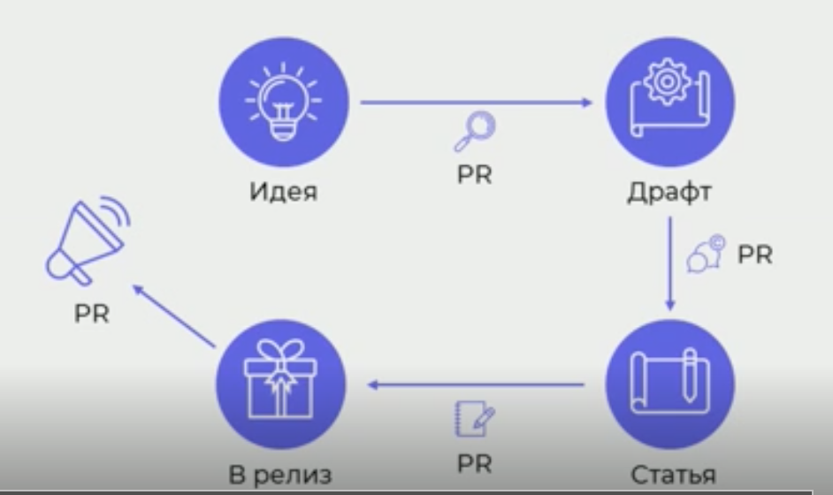

Мария — PR-менеджер в KODE и лидер GDG в Калининграде.
Специфика компании:

* Разработка на аутсорс
* В регионе
* Сотрудники молодые
* Системы обучения нет
* 1 сотрудник решает все задачи с обучением

Руководство:

>   Хотим статьи разработчиков на Хабре и VC, чтобы нас читали, комментировали и хвалили.
    И поэтому чтобы к нам шли работать.
    У топов получается — значит и у нас сработает.

Что с этим делать? Да хоть что-нибудь.

## План номер 1: Я напишу сама!

Внезапно: 

* Разработчики редко умеют и любят писать.
* Время разработчиков дорогое.
* А пиарщику трудно написать статью на техническую тему.

В процессе:

* 6 месяцев попыток
* Страх пустой страницы
* Синдром самозванца

Плюсы:

* Сам себе планировщик.
    Своё время распланировать проще, не надо договариваться про время разработчика.
* Пиарщик пишет грамотнее, чем программист.

Минусы:

* Нет эксперта или ментора.
* Тексты получаются поверхностные.

## План номер 2: интервью

В качестве подготовки провели несколько лекций о том, зачем миру и компании нужны технические статьи.
Вместе нагенерили темы статей.

Идеальный процесс в голове выглядел так:

1. Интервью
1. Редактирование
1. Вычитка
1. Рецензирование
1. Публикация

А в реальности так:

* Вопросы быстро заканчиваются
* Разработчик даёт очень короткие и сжатые ответы
* В ответах много терминов и сложных технических подробностей.
* Плюс: на первое интервью тратим минимум времени разработчика
* Плюс: сразу много материала
* Минус: нет четкой структуры интервью, непонятно о чём спрашивать
* Минус: разработчики разговаривают на жаргоне и техническом английском, их сложно понять не-разработчику.

## План номер три: пишут программисты

Собрали всех заинтересованных в написании статей, объяснили им план.
План был такой:

Идея -> Драфт -> Статья -> В релиз!

Прошло ещё 6 месяцев, не сработало.
Похоже, что не получилось до каждого сотрудника донести процедуру. 
А сотрудникам не хватает команды в написании статьи.

Добавили в схему детали:

* Прежде чем писать драфт, можно обсудить тему с пиарщиком и провести исследование.
* Когда драфт написан, дальше обсуждаем его с пиарщиком и командой.
* Когда статья готова, пиарщик её вычитывает и редактирует.
* И когда статья опубликована, пиарщик будет её пиарить!

Прошло ещё 6 месяцев, выпустили первую статью.

## План номер четыре: ghostwriter

Определение от Марии Кругловой:

Ghostwriter — человек, влияющий на создание статьи с момента зарождения идеи,
в течение всего процесса её написания и защиты, активный модератор статьи, корректор и психолог.
Задача — сформировать у разработчика уверенность, что статью написал именно он.

Процесс

1. Ищем автора. Вот признаки, что человек может:
    * человек выступал на внутреннем девклубе,
    * читал лекцию на стажировках или курсах,
    * вёл практические занятия,
    * выступал на конференциях или митапах,
    * или просто обсуждал что-то в курилке.

2. Создаём основу статьи.
    Берём что угодно, что осталось от первого опыта:
    * презентацию от доклада,
    * инструкции во внутренней доке,
    * конспект для себя перед лекцией,
    * видеозапись выступления;
    * с конференций куча материалов остаётся.

1. Обрабатываем основу:
    * Проверяем «на bullshit»: насколько это уникально и что нового автор открыл миру.
    * Наполняем словом. (Сейчас этот этап чаще делает пиарщик.)
    * Делаем авторский стиль.
    * Добавляем комментарии.
      В тех местах, где ghostwriter'y непонятно, уточняем подробности.

1. Смотри, какую статью ты написал!
    * Проверям, что восприятие в статье верное.
    * Дополняем и работаем с комментариями.
    * Подключаем техлида к ревью (впервые в этом процессе).
      Техлид даёт верные комментарии.
    * Добавляем лоска тексту.

1. В продакшен
    * Публикуем статью
    * Автор в течение нескольких дней отвечает на комментарии
    * Автор сам публикует куда-нибудь ссылки на свою статью, тренирует способность делиться и самопиариться.

1. Через несколько недель после статьи предлагаем написать ещё.

# Результаты

* Повышаем уверенность сотрудников в себе.
* Показываем сотрудникам основные ошибки в тексте.
* Убираем синдром самозванца
* Выпускаем статьи, на это есть KPI
* Иногда разработчики сами приходят.

# Как наладить бесперебойный процесс производства статей

Обучение:

* Лекции в отделах
* Тренинги по написанию статей
* Проверяем идеи статей на жизнеспособность
* Личные встречи с разработчиками.

Мотивация — штука сложная и спорная.
Что сделать, чтобы была мотивация?

* Статья включается в KPI сотрудника.
    Выделяем процентов 20 рабочего времени на написание статьи.
* Те, кто пишут статьи, перыми едут на конференцию.
* Людей мотивирует отклик аудитории и клиентов.

Из приятного: заработало сарафанное радио. 
Люди на собеседованиях вспоминают, что в этой компании ещё и статьи пишут.
А ещё все удивляются, что в Калининграде не только военные и корабли есть.

# Итоговый процесс

выглядит так:

# Правила ghostwriter'а

* благодарить автора за труд и отмечать интересные моменты статьи;
* обращаться к нему за советом, а не говорить об ошибках;
* указывать авторство, если статья написана в общем блоге компании;
* рассказывать о каждой статье везде;
* себя тоже благодарить, чтобы не выгорать.

# Давайте делиться

У Марии есть:

* Чек-лист хорошего текста
* FAQ «Хочу написать статью»
* Практикум «Как написать хороший текст»
* Презентация «Публичный разработчик»

Пишите в телеграм [mkruglova](https://t.me/mkruglova).
