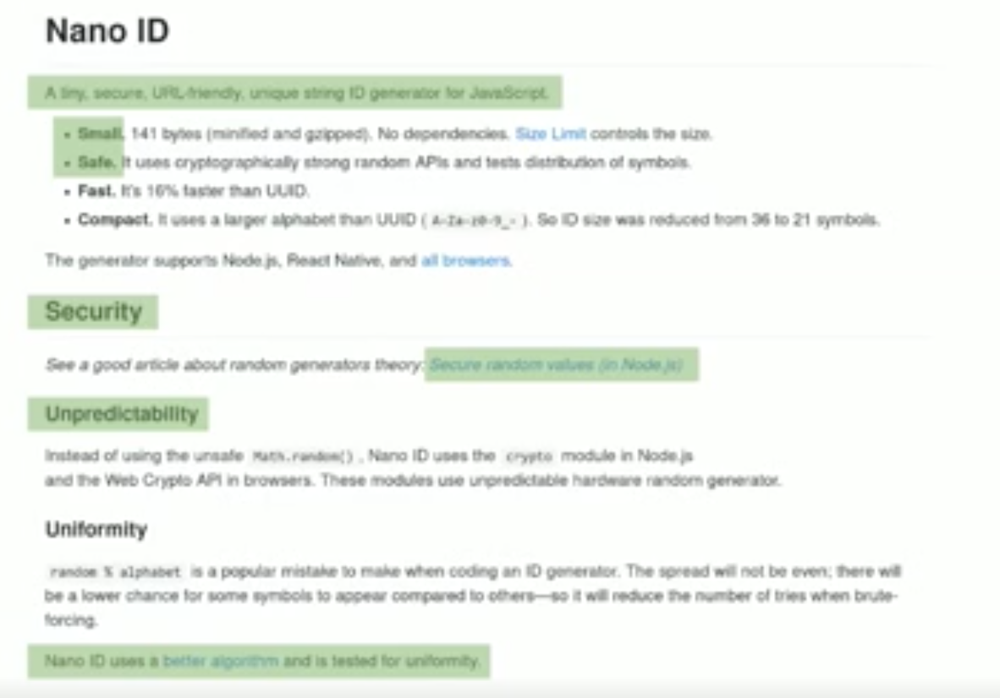

# Продвижение опенсорс-проектов

Андрей Ситник, Злые Марсиане

Однажды появилась методология БЭМ.
Она была реально прорывной.
Однако, о ней до сих пор не весь мир знает.
И есть ещё много крутых вещей, которые созданы в России и мало известны миру.
Это проблема, давайте её решать.

Андей занимается фронтендом в компании Evil Martians.
А ещё у него есть opensource-проекты, вот такие:

> 

На самом деле проектов было немного больше:

> 

## Реальность

* Стать популярным через опенсорс — плохой способ.
    Гораздо полезнее писать статьи и выступать на конференциях.
* Отличный проект не обязательно получит звездочки.
    Более эффективно будет вложить усилия в небольшой PR в популярный проект:
    исправить документацию или починить баг.
* Хороший смысл заниматься опенсорсом — изменить мир.
    Доклады и статьи вдохновляют, но ничего не меняют.
    А код — меняет.
    Например, Autoprefixer вытеснил Compass.
    
Вот анонс Autoprefixer.
Основная ошибка — нет английского языка.

<blockquote class="twitter-tweet" data-lang="en">
Сделал Autoprefixer — он парсит ваш CSS (или Sass) и по базе с Can I Use добавляет нужные (и только нужные) префиксы <a href="https://t.co/2N4JICHhDq">https://t.co/2N4JICHhDq</a>
&mdash; Андрей Ситник (@andrey_sitnik) <a href="https://twitter.com/andrey_sitnik/status/321655851565850624?ref_src=twsrc%5Etfw">April 9, 2013</a></blockquote>

## Формула успеха проекта

Популярность проекта = 
    ваша популярность +
    продвижение +
    преимущества для пользователей +
    удача.
    
Популярность проекта зависит от вашей, а ваша — от популярности проекта.

Создайте англоязычный твиттер!
Старый проект набирает подписчиков, их можно использовать для 

Неважно, как пользователь узнает о вашем проекте. 
Рано или поздно ему потребуется документация.

Когда и как люди читают документацию.
Спокойно и с чашечкой кофе? Нет!
Они в огне, у них нет времени и сил.
Объясните, зачем людям читать вашу документацию, иначе они не будут читать.

Плохо:

> :x: Svelte is cybernetically enhanced web apps

Хорошо:

> :heavy_check_mark: Svelte is JS framework with unique compiler which generates smaller JS files

Конкретнее:

1. Точное описание
1. Чем это полезно
1. Почему это важно

Начало README — самый важный текст.
Потратьте на его написание много времени и сделайте хорошо.

Как сделать хорошее описание?
Представьте, что вы в баре объясняете друзьям, что у вас за проект.
Теперь сделайте описание лаконичным, сократите до 2-4 предложений.

Люди читают не весь текст.
Примерно вот столько:

> 

Что с этим делать?

* **Добавляйте иллюстрации** и примеры кода.
* **Выделяйте главное** в начале пункта списка.

## Как люди выбирают фреймворки?

Кажется, что они делают этот выбор рационально.
На самом деле нет.
Люди выбирают то, про что говорят лидеры мнений.

Важно писать, кто использует проект.
Чтобы кто-то его использовать, можно прийти в любой проект и предложить заменить зависимость.
После первого проекта становится проще: «а Х уже перешли на наш инструмент».

Раз в месяц нужно что-то писать и говорить о проекте.
Статьи, доклады, твиттер.

Получается, что всё держится на хайпе, и чтобы конкурировать, нужно только подливать масла в огонь хайпа.
Всё это грустно.
Поэтому доклад закончился и теперь будет другой доклад.

---

# Как мы убиваем инновации во фронтенде

Андрей Ситник, Злые Марсиане

Однажды Испания профинансировала стартап Колумба и он открыл Америку.
Это произошло по ошибке.
В Америке испанцы нашли серебро, обогатились на нём, но всё потратили на войны и прочую ерунду.

В развитии технологии есть три стадии:
1. В проект никто не верит
1. Бурный рост
1. Инновации останавливаются

## Фронтенд умер

Фронтенд сейчас в третьей стадии.
Мы богаты и пьём смузи, это ок.
Но мы на этом богатстве развиваем стагнацию.
Например, выбираем проекты по количеству звездочек и скачиваний.

Звёздочки не гарантируют поддержки.
Например, 

* CSS Modules популярно, но не поддерживается.
* Люди гордятся использованием React, хотя во множестве кейсов есть решения на порядок проще и лучше.

Распределение подписчиков в Twitter аномальное.
У 1% людей есть 99% подписчиков.
В результате один человек решает, о чём узнает вся отрасль.

Получается, что социальные лифты сломаны и новым лидерам сложно появиться.
Популярность приносит ещё большую популярность.
Вместо того, чтобы сломать этот замкнутый круг, мы его поддерживаем.

## Да здравствует фронтенд!

Что с этим всем делать?

1. Выбирайте правильно
    
    Как НЕ НУЖНО выбирать инструменты и зависимости для фронтенда:
    
    * по звёздочкам
    * потому что хайп
    * потому что используется в компании Х
    * потому что лидер мнений рекомендовал
    
    Как выбирать инструменты и зависимости для фронтенда:
    
    * поискать на npm
    * сравнить размеры: bundlephobia.com
    * сделать свои бенчмарки
    * сколько issues без ответа?
    * сделать маленькое демо

2. Большой проект не означает, что вам быстро ответят и помогут.
    Это зависит от мейнтейнера и ещё кучи вещей.
    
    А ещё фреймворки на самом деле не очень важны для бизнеса.
    
    Специализированные инструменты обычно лучше, чем универсальные.
    Ищите специализированный инструмент под задачу.

3. Продвигайте непопулярных разработчиков.
Андрей проводит черту на 7000 подписчиков: меньше — ретвитить почаще, больше — ретвитить реже.

4. Не ограничивайтесь только математикой и computer science.
    На стыках с другими областями появляется новое.

5. Постарайтесь увидеть большую картину.

    Например, метрики — не серебряная пуля.
    Они не помогут сделать качественный скачок.
    
6. Наконец, не бойтесь.
    Фронтенд не первый, где закончились инновации.
    Чтобы появилось новое — не бойтесь, рискуйте и танцуйте на столах.
