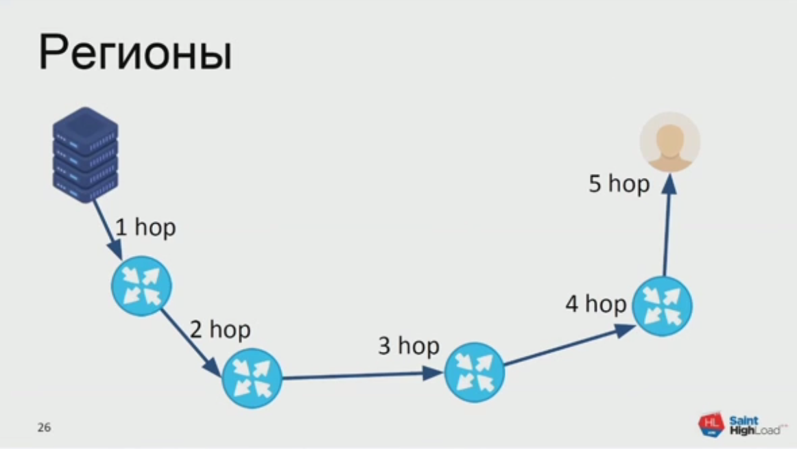
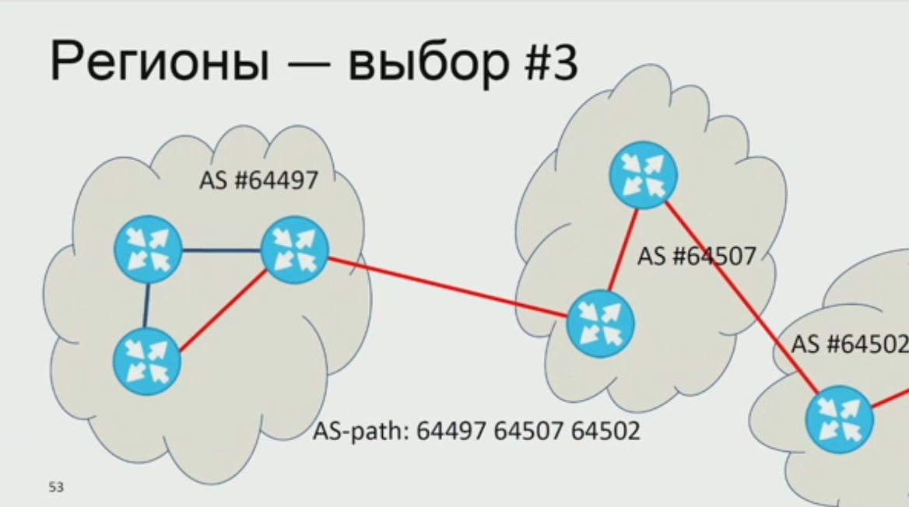
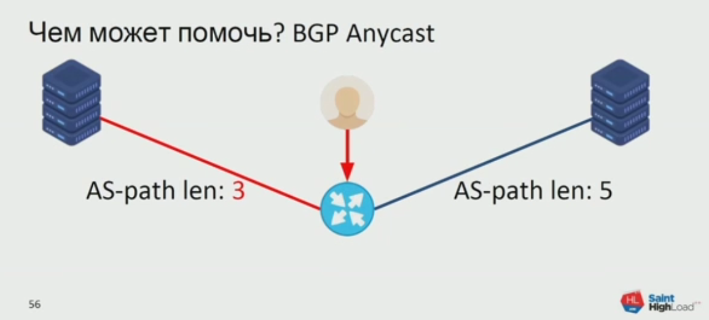
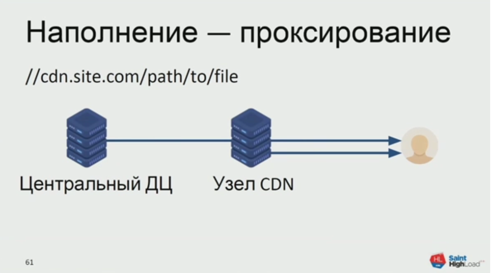
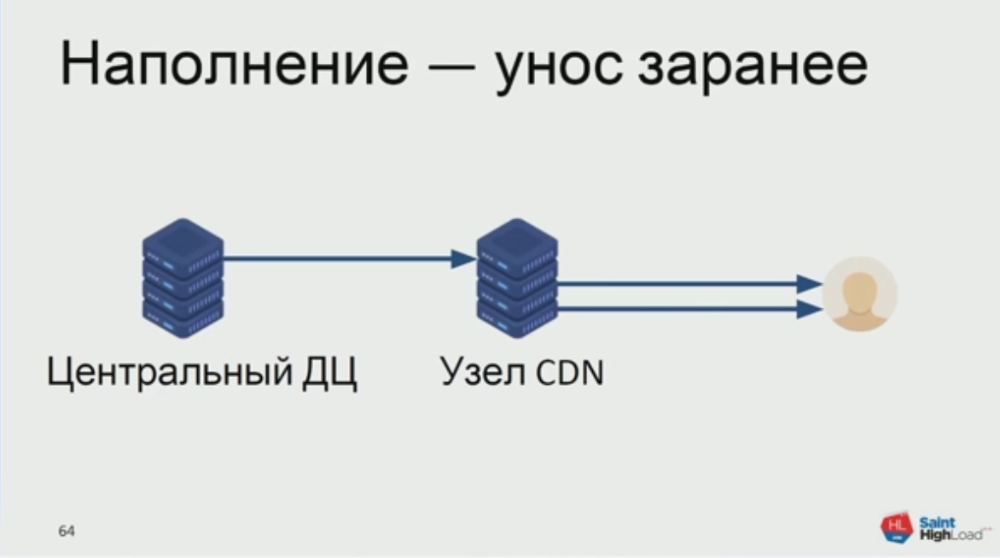
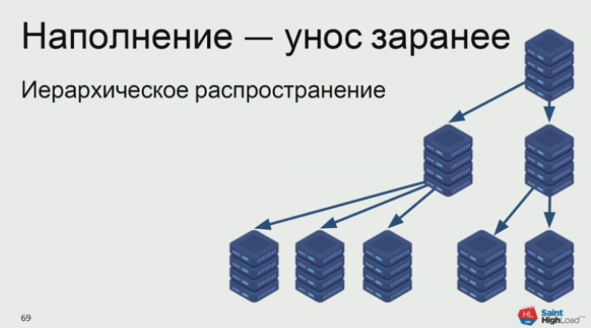
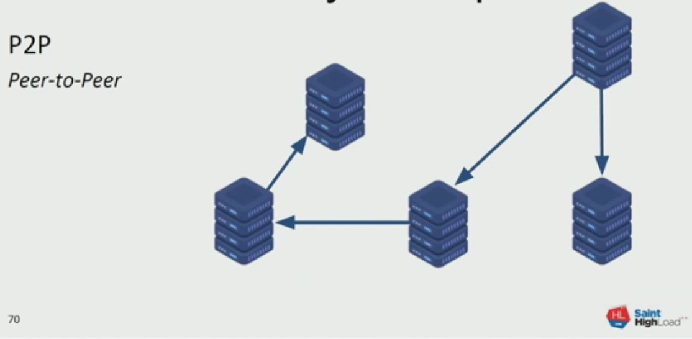

<p align="right"><a href = "https://www.highload.ru/spb/2019"> Saint HighLoad++</a> 
<a href = "https://knowledgeconf.ru"> KnowledgeConf</a> 
<a href = "https://t.me/docops">@docops</a>
</p>

# CDN своими руками

Алексей Акулович, VK

Зачем этот доклад:

* Раньше только админы этим занимались, теперь участвуют разработчики.
    Алексей поделится опытом.
* CDN — не чёрный ящик, но о нём мало рассказывают нормальным языком для не-сетевиков.
    
<!-- START doctoc generated TOC please keep comment here to allow auto update -->
<!-- DON'T EDIT THIS SECTION, INSTEAD RE-RUN doctoc TO UPDATE -->


- [Контент](#%D0%BA%D0%BE%D0%BD%D1%82%D0%B5%D0%BD%D1%82)
- [Решение по-старинке](#%D1%80%D0%B5%D1%88%D0%B5%D0%BD%D0%B8%D0%B5-%D0%BF%D0%BE-%D1%81%D1%82%D0%B0%D1%80%D0%B8%D0%BD%D0%BA%D0%B5)
  - [Проблема «Аватарка Павла»](#%D0%BF%D1%80%D0%BE%D0%B1%D0%BB%D0%B5%D0%BC%D0%B0-%C2%AB%D0%B0%D0%B2%D0%B0%D1%82%D0%B0%D1%80%D0%BA%D0%B0-%D0%BF%D0%B0%D0%B2%D0%BB%D0%B0%C2%BB)
- [Идём в регионы](#%D0%B8%D0%B4%D1%91%D0%BC-%D0%B2-%D1%80%D0%B5%D0%B3%D0%B8%D0%BE%D0%BD%D1%8B)
  - [Вариант 1: выдавать прямую ссылку в коде](#%D0%B2%D0%B0%D1%80%D0%B8%D0%B0%D0%BD%D1%82-1-%D0%B2%D1%8B%D0%B4%D0%B0%D0%B2%D0%B0%D1%82%D1%8C-%D0%BF%D1%80%D1%8F%D0%BC%D1%83%D1%8E-%D1%81%D1%81%D1%8B%D0%BB%D0%BA%D1%83-%D0%B2-%D0%BA%D0%BE%D0%B4%D0%B5)
  - [Вариант 2: используем DNS для выбора региона](#%D0%B2%D0%B0%D1%80%D0%B8%D0%B0%D0%BD%D1%82-2-%D0%B8%D1%81%D0%BF%D0%BE%D0%BB%D1%8C%D0%B7%D1%83%D0%B5%D0%BC-dns-%D0%B4%D0%BB%D1%8F-%D0%B2%D1%8B%D0%B1%D0%BE%D1%80%D0%B0-%D1%80%D0%B5%D0%B3%D0%B8%D0%BE%D0%BD%D0%B0)
  - [Вариант 3](#%D0%B2%D0%B0%D1%80%D0%B8%D0%B0%D0%BD%D1%82-3)
- [Наполняем сервера контентом](#%D0%BD%D0%B0%D0%BF%D0%BE%D0%BB%D0%BD%D1%8F%D0%B5%D0%BC-%D1%81%D0%B5%D1%80%D0%B2%D0%B5%D1%80%D0%B0-%D0%BA%D0%BE%D0%BD%D1%82%D0%B5%D0%BD%D1%82%D0%BE%D0%BC)
  - [Наполняем через проксирование](#%D0%BD%D0%B0%D0%BF%D0%BE%D0%BB%D0%BD%D1%8F%D0%B5%D0%BC-%D1%87%D0%B5%D1%80%D0%B5%D0%B7-%D0%BF%D1%80%D0%BE%D0%BA%D1%81%D0%B8%D1%80%D0%BE%D0%B2%D0%B0%D0%BD%D0%B8%D0%B5)
  - [Уносим файл заранее](#%D1%83%D0%BD%D0%BE%D1%81%D0%B8%D0%BC-%D1%84%D0%B0%D0%B9%D0%BB-%D0%B7%D0%B0%D1%80%D0%B0%D0%BD%D0%B5%D0%B5)
- [Загружаем из регионов](#%D0%B7%D0%B0%D0%B3%D1%80%D1%83%D0%B6%D0%B0%D0%B5%D0%BC-%D0%B8%D0%B7-%D1%80%D0%B5%D0%B3%D0%B8%D0%BE%D0%BD%D0%BE%D0%B2)

<!-- END doctoc generated TOC please keep comment here to allow auto update -->

# Контент

Какой контент может раздавать CDN:

* статика сайта: HTML, JS, CSS
* обычные файлы: фото, аудио, видео, документы...
* потоковый контент: HLS/DASH, RTMP(TCP), QUIC(UDP)...

# Решение по-старинке

У нас есть сервер, который просто раздаёт контент пользователям.
Что в первую очередь на нём кончится? Сеть!
Придётся вертикально масштабировать этот сервер (ставить ещё сетевые карты и т.д.), это не бесконечно.

Ещё бывает горячий контент.
Какие-то файлы скачивают чаще других.
Если все серверы будут готовы раздавать самый горячий контент,
то большинство из них будут простаивать.

## Проблема «Аватарка Павла»

vk.com/images/pics/durov_400.jpg


Сначала фото лежало просто на сервере, и этот сервер сильно нагружался.
Решение: разложили фото на все фронты как часть статики сайта — как иконки и стили.

Ещё трафик стоит денег.
Больше трафика — больше расходов.

И, конечно, у пользователей разное качество каналов.
Вот основные показатели качества:

* RTT, round-trip time (ping)
* Jitter, max(RTT) - min (RTT)
* Packet loss

# Идём в регионы

Получается, мы должны быть физически ближе к пользователям и идти в регионы.
Вот путь от пользователя до сервера.
Каждый hop — это 1) задержка и 2) шанс потери пакета.



Решение: улучшить качество той части маршрута, на которую мы можем повлиять.
Достаточно иметь свой сервер в сети местного оператора связи
и договориться о достаточно хорошем канале связи от него до пользователя.
Таких операторов обозримое количество, задача выполнимая.

Плюсы:

* Пользователь получает контент быстрее
* Мы разгружаем каналы и центральные ДЦ
* Провайдеры экономят на трафике, потому что раздают из своей сети

Ок, мы поставили две зоны.
Как направить пользователя в ту, которая ближе?

## Вариант 1: выдавать прямую ссылку в коде

Это сработает, если у нас по одной точке присутствия в каждой стране.

```php
geoip_country_code_by_name($IP)
```

А если у нас много точек присутствия и мы хотим определять зону
с точностью до региона?
Можно попробовать более детальную базу.

github.com/maxmind/GeoIP2-pip: city, postal code, latitude/longitude

Но тут есть проблемы:

* База GeoIP не идеальна, не полностью актуальна, отстаёт в развитии и может ошибаться
* Географическая близость ≠ сетевая близость и быстрый доступ.

## Вариант 2: используем DNS для выбора региона

//site.com/path/to/file

site.com IN ...
    A 10.20.30.40
    A 50.60.70.80
    
Сработает? Нет. DNS не выбирает нам ближайший IP, поэтому будет случайный.
Чтобы это заработало, DNS должен уметь по IP пользователя выбирать IP точки в его зоне.

Проблемы:

* Всё ещё зависим от базы GeoIP
* TTL обновления кеша DNS-записей.
    Есть период, когда пользователи продолжают ходить на старые адреса.
    А если мы уменьшаем TTL, то увеличиваем нагрузку на DNS-сервер.

## Вариант 3: используем BGP

Интернет неоднороден.
Он состоит из локальных сетей провайдеров или организаций — 
[автономных систем](https://ru.wikipedia.org/wiki/%D0%90%D0%B2%D1%82%D0%BE%D0%BD%D0%BE%D0%BC%D0%BD%D0%B0%D1%8F_%D1%81%D0%B8%D1%81%D1%82%D0%B5%D0%BC%D0%B0_(%D0%98%D0%BD%D1%82%D0%B5%D1%80%D0%BD%D0%B5%D1%82)),
[autonomous systems, AS](https://en.wikipedia.org/wiki/Autonomous_system_%28Internet%29).
Они сами делают маршрутизацию внутри себя.
А интернет — связь между этими сетями, которая обеспечивает глобальную доставку.

Всего есть около 65 000 таких автономных систем (AS).
Они связаны по протоколу BGP — Border Gateway Protocol.
Он позволяет понять, через какие автономные системы мы будем отправлять пакет.

Каждый маршрутизатор знает своих соседей, те — своих, и так далее.
Из этого получается граф достижимости по маршрутизаторам.
При этом каждая AS имеет свой список сетевых префиксов, которые в ней есть.
Она анонсирует этот список соседям.
Благодаря этому каждый маршрутизатор знает, в какой системе есть нужная ему подсеть.
Можно получить путь к нужной подсети через цепочку AS.



Теперь мы можем выбрать ту точку присутствия, к которой ближе путь от пользователя.



Что мы получаем с BGP:

* нет завязку на базу GeoIP
* быстро реагируем на изменения
* ближе к реальному пути пакета между пользователем и сервером

# Наполняем сервера контентом


Роутинг это ещё не вся задача.
Пока что сервера у нас пустые.
Давайте наполним их контентом.


## Наполняем через проксирование



Всё работает, но нет контроля за популярностью файла.
Мы скачаем и сохраним в кеше даже файл, который пользователь запрашивал один раз.

## Уносим файл заранее

Поняли, что файл популярен в регионе. 
Уносим его туда заранее.



Проблемы:
* Не совместим с Anycast BGP.
* Есть задержка появления файла.
    Первый пользователь всё равно ждёт, пока мы проксируем файл.

Зато есть контроль наполнения.

Есть несколько способов уносить файлы:

* Сразу распределять по всем узлам: «точка-многоточка».
    Тут мы многократно повторяем трафик из центра в регионы и за это платим.
    
    
    
* Иерархическое распространение.
    Сначала распределяем по нескольким регионам, те раздают соседям.
    
    

    
* P2P, peer-to-peer.
    Комбинированный режим.
    Когда только начинаем раздавать, растёт нагрузка на центр, как в первом варианте.
    Потом когда некоторые докачали, они сами встают на раздачу и мы получаем второй вариант.
    
    

    
# Загружаем из регионов

Пользователи могут не только скачивать, но и загружать из регионов.
Пускай загружают в региональный ДЦ, так даже быстрее для пользователей.
А потом мы распределим по сети.

В зависимости от типа контента VK используют разные способы.

* Тяжёлый контент (видео и музыку) уносим заранее.
    Строим рейтинги файлов, кэш посредством демона.
* Лёгкий контент (картинки, стикеры, документы) проксируем.
    Подсчёт хитов + кэш в nginx.

Ни одна из описанных выше схем не работает нормально в чистом виде.

BGP учитывает не качество, а стоимость каналов.
Провайдеры анонсируют не самые быстрые, а самые дешёвые связи между сетями.

Поэтому BGP используем только для построения топологии.

(будет продолжение)
